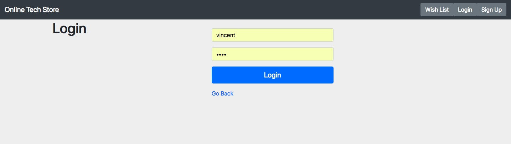

# Project Title: Online Tech Store Web Development
**Website Name: Online Tech Store**
## Project description:  
* This project aims to design and develop a website for online tech store, which can be used in real word. The model applies to business model that consists of both administrator and customers. An admin is needed to manage the whole website, by signing up with the username **admin** to achieve corresponding function. In more detail, we have two types of people involved in the business: One is Admin, who can manage all the products posted in the website. Admin can add a new product, delete a product, and update the information of product posed in the website. The other type of people is user, who viewing and shopping products. This website implemented the following functions:
-------
*  User sign up and login: a user can create his/her own account to keep track of his/her wish list and purchase record.
* Search or filter: any user who wants a specific product can search by keyword, or filter by category. Or User can also just list all the products by page.
3. Wish list: a user who has been logged in can add/delete/update a product in or out of his/her wish list.
4. Purchase: a user can purchase a product in the product information page. The database will update the inventory when a user purchase some product.
5. Purchase record: a user can see his/her purchase record and reviews of a product on the product information page.
6. For add new product: an admin would need to provide product name, description, image (URL or local file), price, number of product in stock.
7. For update product: An admin is able to update any information of a product. For delete product: when an admin delete the product, the product would not listed on the website, but when the quantity of a product is set to 0, the product would be shown out of stock.

## DataBase Design:  
* We use MongoDB for database component. We have user.js, tech.js, comment.js, wishlist.js to represent the data model. The following provide the information about data model.
----
* user.js: attributes are username, password.
* tech.js: attributes are name, price, quantity, image, description, author (id, username), and comments.
* comment.js: attributes are text, quan, author (id, username).
* Wishlist.js: the same attributes as tech.js plus attribute belong.
----
Languages/frameworks used:
* For front-end: EJS as view engine, bootstrap and CSS for style. 
* For back-end: Express.js
* Database: MongoDB
* Node.js as the runtime for these framework

## Team Members:
| Erdong Liao | exl170630 |
| --- | --- |
| **Jiadao Zou** | **jxz172230** |
| **Zhan Wang** | **zxw173430** |
----
### Work division:
* Every member of the team work together to complete this project. The following mention who contribute more on which part.
----
* Server side scripting: Erdong Liao, Wang Zhan    
* Client-side scripting: Wang Zhan, Jiadao Zou 
* Database Design: Jiadao Zou, Erdong Liao
  
## Screen Shoots:
**Landing Page**
**Sign Up**
**Login In**

**Add New Item**
**Search Items**
**Wish List**

